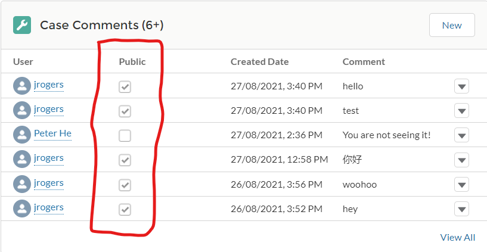
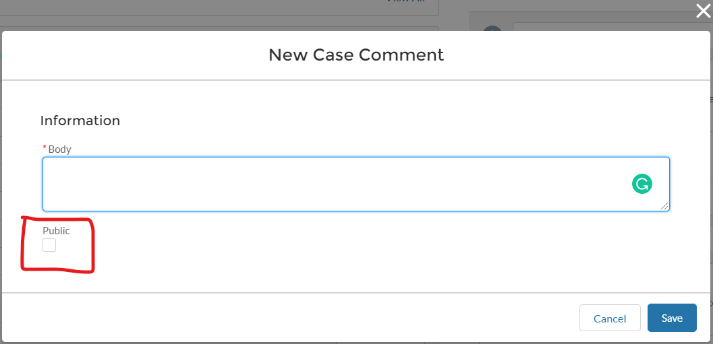
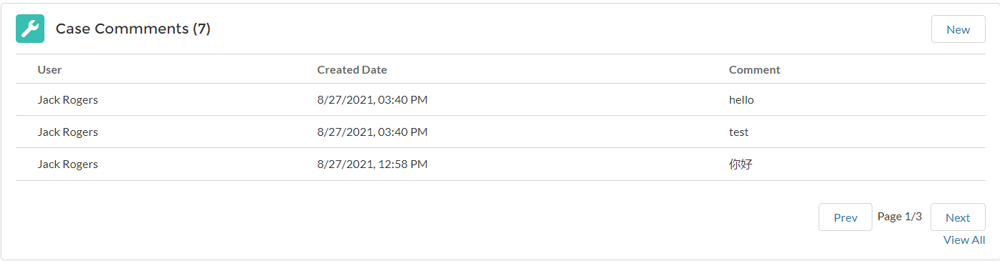
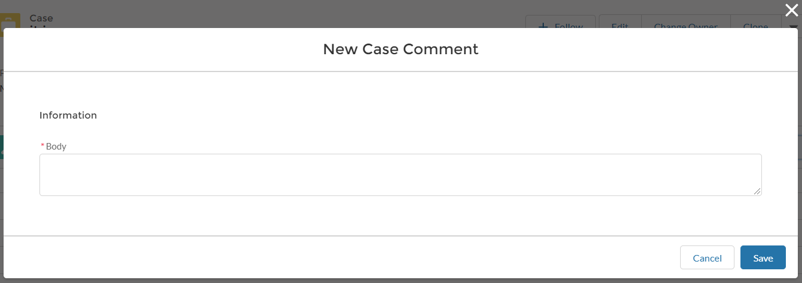
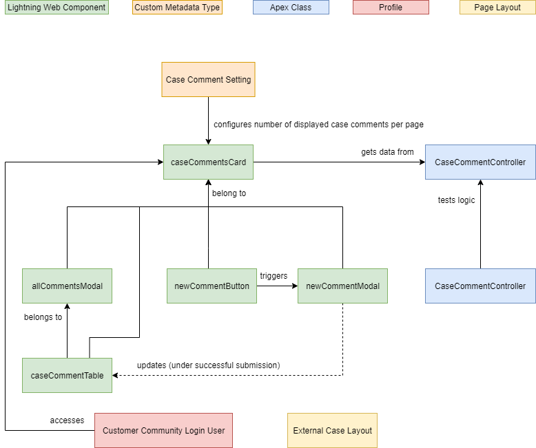

# Salesforce Experience Cloud Case Comments

The out of the box case comment via Salesforce Experience Cloud (Community) displays a checkbox labelled "`public`" on both the related list and pop-up modal, which is to indicate whether the comment should be visible to external users or not. It is helpful for internal users, but confusing for external users.

### Out of the box component

### Out of the box pop-up modal

## The New Component without Confusion

The new case comment component excludes the "`public`" checkbox in both the component itself and the pop-up modal. In addtion, Salesforce admins are now able to configure the number of comments displayed on each page, while external users can use the buttons "`Prev`" and "`Next`" to view more comments, or click "`View All`" to view all the comments on the case.

### New component

### New pop-up modal

## Elements

### 1. Lightning Web Components

- caseCommentsCard

    The component displays a specific number of case comments per page.

    It is added to the case detail page of the Experience Cloud Site.

- allCommentsModal

    A child component of `caseCommentsCard` component.

    It displays all the case comments on the case.

    It is displayed when `View All` is clicked.

- caseCommentTable

    A child component of `caseCommentsCard` and `allCommentsModal` components.

    It displays the case comments in the table view.

- newCommentModal

    A child component of `caseCommentsCard` component.
    
    It allows users to submit a new case comment on the case.

- newCommentButton

    A child component of `caseCommentsCard` component.

    It invokes the popup of `newCommentModal` component.

### 2. Apex Classes

- CaseCommentController

    The Apex class that provides related data for `caseCommentsCard` component.

- CaseCommentControllerTest

    The Apex test class that tests the logic in `CaseCommentController`.

### 3. Custom Metadata Types

- Case Comment Setting

    The custom metadata type that configures how many case comments to be displayed per page in `caseCommentsCard`.

### 4. Profiles

- Customer Community Login User

    The profile that is assigned to the external users in the Experience Cloud Site.

    It allows the users to access `caseCommentsCard`.

    It allows the users to read and create case comments.

### 5. Page Layouts

- External Case Layout for Case

    The page layout that is assigned to the external users in the Experience Cloud Site.
    
    It excludes the confusing out of the box component under related lists on the Case Detail page.

## Instruction of Configuration (System Admin Only)

1. Go to Setup in Salesforce.
2. Type `Custom Metadata Types` in the "Quick Find" search box.
3. Click `Custom Metadata Types` under `Custom Code`.
4. Click `Manage Records` next to `Case Comment Setting`.
5. Click `Edit` next to `Experience Site`.
6. Enter your desired number in `Number of Comments to Display`.
7. Click `Save`.
8. Login to the Experience Cloud Site as an external user, then you will see the number of case comments displayed per page is changed to the number you just saved.
